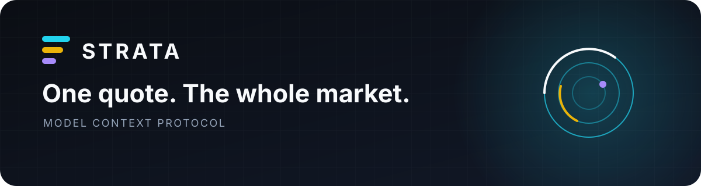

<p align="center">
  
</p>

<h1 align="center">Strata MCP</h1>

<p align="center">
  Put live Strata markets and Sonar pricing inside any MCP-compatible agent.
</p>

<p align="center">
  <a href="https://stratabook.app/docs/agent-mcp">Documentation</a>
  ·
  <a href="https://github.com/alsk1992/strata-sdk-ts">TypeScript</a>
  ·
  <a href="https://github.com/alsk1992/strata-agent-skills">Agent Skills</a>
  ·
  <a href="https://stratabook.app">Strata</a>
</p>

One hosted connection gives an agent current market availability and
decision-ready quotes from Sonar—Strata's unified liquidity and matching
system. No local daemon is required.

## Connect

Add Strata as a Streamable HTTP server:

```json
{
  "mcpServers": {
    "strata": {
      "type": "streamable-http",
      "url": "https://api.stratabook.app/mcp"
    }
  }
}
```

That is the complete hosted setup. Once connected, the client discovers the
Strata tools currently available to it.

## See Strata answer from a terminal

Use the official MCP Inspector (Node.js 22.7.5+) to list the hosted tools:

```sh
npx -y @modelcontextprotocol/inspector --cli \
  https://api.stratabook.app/mcp \
  --transport http \
  --method tools/list
```

Call Strata directly:

```sh
npx -y @modelcontextprotocol/inspector --cli \
  https://api.stratabook.app/mcp \
  --transport http \
  --method tools/call \
  --tool-name strata_markets \
  --tool-arg includePaused=false
```

Request a live Sonar quote through the same connection:

```sh
npx -y @modelcontextprotocol/inspector --cli \
  https://api.stratabook.app/mcp \
  --transport http \
  --method tools/call \
  --tool-name strata_quote \
  --tool-arg market=SOL/USDC \
  --tool-arg side=sell \
  --tool-arg 'amountInAtoms="10000000"' \
  --tool-arg slippageBps=50
```

The response is structured data, ready for terminals, scripts, and agents.

## What lands in the agent

| Tool | Result |
| --- | --- |
| `strata_capabilities` | The Strata features available in the current session |
| `strata_markets` | Markets, token decimals, and current Sonar quote readiness |
| `strata_quote` | Expected output, consumed input, fees, minimum output, price impact, and expiry |

### A Sonar quote call

```json
{
  "market": "SOL/USDC",
  "side": "sell",
  "amountInAtoms": "10000000",
  "slippageBps": 50
}
```

The result gives an agent the economics it needs to reason clearly:

```json
{
  "provider": "Sonar",
  "amount_in_consumed_atoms": "10000000",
  "amount_out_atoms": "1990000",
  "minimum_output_atoms": "1980050",
  "output_fee_atoms": "995",
  "reference_price": "199.1",
  "price_impact_pct": "0.0005"
}
```

The values above use the repository's versioned example fixture. Live quotes
also include a unique quote ID and authoritative expiry.

Sonar handles the market. Your agent works with one economic result.

## Hosted or local

| | Hosted Streamable HTTP | Local stdio |
| --- | --- | --- |
| Start with | `https://api.stratabook.app/mcp` | `npx -y @stratabook/mcp` |
| Best for | Agents with remote MCP support | Desktop clients and local toolchains |
| You operate | Nothing | The local Node.js process |
| Strata market data | Live | Live |

Local stdio configuration:

```json
{
  "mcpServers": {
    "strata": {
      "command": "npx",
      "args": ["-y", "@stratabook/mcp"]
    }
  }
}
```

Node.js 20+ is required for the local package.

## Self-host Streamable HTTP

```sh
npx -y @stratabook/mcp \
  --transport http \
  --host 127.0.0.1 \
  --port 8787
```

The server binds to loopback by default. Add TLS, authentication, and rate
limiting before making a self-hosted instance remotely accessible.

## Built for exact automation

- Token values stay as atomic-unit decimal strings.
- Quote expiry and minimum output remain explicit fields.
- The tool set follows what Strata currently makes available.
- Errors include stable codes and retryability hints.

`0.1.x` provides market discovery and read-only Sonar quotes. It cannot prepare,
sign, or submit transactions and never asks for wallet or private-key material.

## Resources

- [Agent quick start](https://stratabook.app/docs/hello-agents)
- [MCP documentation](https://stratabook.app/docs/agent-mcp)
- [TypeScript SDK](https://github.com/alsk1992/strata-sdk-ts)
- [Issues and feature requests](https://github.com/alsk1992/strata-mcp/issues)
- [Security policy](SECURITY.md)

Licensed under either [Apache-2.0](LICENSE-APACHE) or [MIT](LICENSE-MIT).
